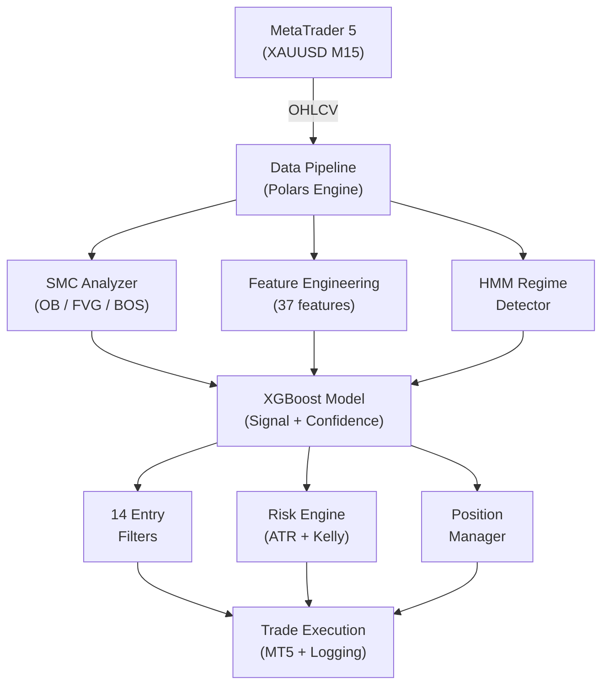

# XAUBot AI

**AI-powered XAUUSD (Gold) trading bot** using *XGBoost ML*, *Smart Money Concepts* (SMC), and *Hidden Markov Model* regime detection for *MetaTrader 5*.

[](https://www.python.org/downloads/)
[](LICENSE)
[](https://www.metatrader5.com/)

---

## Features

| Feature | Description |
|---------|-------------|
| **XGBoost ML Model** | 37-feature model predicting BUY/SELL/HOLD with calibrated confidence |
| **Smart Money Concepts** | Order Blocks, Fair Value Gaps, Break of Structure, Change of Character |
| **HMM Regime Detection** | 3-state Hidden Markov Model classifying the market as trending/ranging/volatile |
| **Dynamic Risk Management** | ATR-based Stop Loss, Kelly criterion position sizing, daily loss limit |
| **Session Awareness** | Optimized for Sydney, London, and New York sessions |
| **Auto-Retraining** | Models automatically retrain when market conditions change |
| **Telegram Bot** | Trade alerts, hourly analysis, daily summary, and commands (`/status`, `/news`, ...) from the `/` menu |
| **News Filter** | No new entries ±1h around NFP / FOMC / CPI; toggle with `/news on\|off` |
| **Configurable Lot Size** | `BASE_LOT` / `MAX_LOT` / `RECOVERY_LOT` in `.env` |
| **macOS Support** | Runs against MetaTrader 5.app (Wine) through an RPyC bridge |
| **Web Dashboard** | Next.js monitoring interface for live tracking |

## What's New in This Fork

| Change | Details |
|--------|---------|
| **macOS support** | `MetaTrader5` runs under the Windows Python inside MetaTrader 5.app's Wine prefix; the bot reaches it over RPyC (`./start_mt5_server.sh`, `MT5_HOST=127.0.0.1`) |
| **News filter re-enabled** | Blocks new entries ±1h around NFP, FOMC and CPI (WIB). Open positions are still managed. Fixed a bug that always reported SAFE, and corrected the 2025–2026 FOMC dates |
| **Telegram `/news`** | Status (SAFE / BLOCKED / OFF), upcoming news block windows, `/news on` / `/news off` toggle, alerts when a block starts and ends |
| **Telegram `/` menu** | All commands registered with Telegram, so typing `/` shows a tap-to-run list |
| **Lot size in `.env`** | `BASE_LOT`, `MAX_LOT`, `RECOVERY_LOT` (validated at startup) instead of hardcoded 0.01 / 0.02 |
| **Training fix** | Walk-forward validation no longer overwrites the trained model with its last 500-bar fold |
| **English everywhere** | All log messages, Telegram texts and code comments translated from Indonesian |
| **Docker DB hardening** | PostgreSQL port bound to `127.0.0.1` only |
| **Run guide** | Step-by-step setup in [docs/RUNNING.md](docs/RUNNING.md) |

See [CHANGELOG.md](CHANGELOG.md) for details.

## Architecture



## Project Structure

```
xaubot-ai/
├── main_live.py              # Main async trading orchestrator
├── train_models.py           # Model training script
├── src/                      # Core modules
│   ├── config.py             #   Trading configuration & capital modes
│   ├── mt5_connector.py      #   MetaTrader 5 connection layer
│   ├── smc_polars.py         #   Smart Money Concepts analyzer
│   ├── ml_model.py           #   XGBoost trading model
│   ├── feature_eng.py        #   Feature engineering (37 features)
│   ├── regime_detector.py    #   HMM market regime detection
│   ├── risk_engine.py        #   Risk calculations & validation
│   ├── smart_risk_manager.py #   Dynamic risk management
│   ├── session_filter.py     #   Session filter (Sydney/London/NY)
│   ├── position_manager.py   #   Open position management
│   ├── dynamic_confidence.py #   Adaptive confidence thresholds
│   ├── auto_trainer.py       #   Auto-retraining pipeline
│   ├── news_agent.py         #   Economic news filter
│   ├── telegram_notifier.py  #   Telegram notifications
│   ├── trade_logger.py       #   Trade logging to DB
│   └── utils.py              #   Utility functions
├── backtests/                # Backtesting
│   ├── backtest_live_sync.py #   Main backtest (synced with live)
│   └── archive/              #   Historical versions
├── scripts/                  # Utility scripts
│   ├── check_market.py       #   Quick SMC market analysis
│   ├── check_positions.py    #   View open positions
│   ├── check_status.py       #   Account status check
│   ├── close_positions.py    #   Emergency close all positions
│   ├── modify_tp.py          #   Modify take-profit levels
│   └── get_trade_history.py  #   Pull trade history
├── tests/                    # Tests
├── models/                   # Trained models (.pkl)
├── data/                     # Market data & trade logs
├── docs/                     # Documentation
│   ├── arsitektur-ai/        #   Architecture docs (23 components)
│   └── research/             #   Research & analysis
├── web-dashboard/            # Next.js monitoring dashboard
├── docker/                   # Docker configuration & scripts
│   ├── scripts/              #   Helper scripts (.bat/.sh)
│   └── docs/                 #   Docker documentation
└── archive/                  # Deprecated files (gitignored)
```

## Backtest Results (Jan 2025 - Feb 2026)

| Metric | Value |
|--------|-------|
| Total Trades | 654 |
| Win Rate | 63.9% |
| Net P/L | $4,189.52 |
| Profit Factor | 2.64 |
| Max Drawdown | 2.2% |
| Sharpe Ratio | 4.83 |

## Installation

### Docker Deployment (Recommended)

**Quick Start:**

```bash
# 1. Clone the repository
git clone https://github.com/GifariKemal/xaubot-ai.git
cd xaubot-ai

# 2. Configure environment
cp docker/.env.docker.example .env
# Edit .env with your MT5 credentials

# 3. Start all services (Windows)
docker\scripts\docker-start.bat

# 3. Start all services (Linux/Mac)
./docker/scripts/docker-start.sh
```

**Available services:**
- Dashboard: http://localhost:3000 (change with `DASHBOARD_PORT` in `.env` if 3000 is taken)
- API: http://localhost:8000
- API docs: http://localhost:8000/docs
- Database: localhost:5432

All ports listen on `127.0.0.1` only (the API has no login). The API only accepts browser requests from the dashboard (`CORS_ORIGINS`).

**Full Docker documentation:** See [docker/docs/DOCKER.md](docker/docs/DOCKER.md)

---

### Manual Installation

**Prerequisites:**
- Python 3.11+
- MetaTrader 5 terminal (Windows, or MetaTrader 5.app on macOS, see [docs/RUNNING.md](docs/RUNNING.md))
- PostgreSQL (optional, for trade logging)

**Setup:**

```bash
# Clone the repository
git clone https://github.com/GifariKemal/xaubot-ai.git
cd xaubot-ai

# Install dependencies
pip install -r requirements.txt

# Configure environment
cp .env.example .env
# Edit .env with your MT5 credentials and Telegram token
```

### Configuration

Key settings in `.env`:

```env
# MetaTrader 5
MT5_LOGIN=your_login
MT5_PASSWORD=your_password
MT5_SERVER=your_server
MT5_PATH=C:/Program Files/MetaTrader 5/terminal64.exe

# Telegram Notifications
TELEGRAM_BOT_TOKEN=your_bot_token
TELEGRAM_CHAT_ID=your_chat_id

# macOS only: MT5 bridge (leave empty on Windows)
MT5_HOST=127.0.0.1
MT5_PORT=18813

# Trading
CAPITAL=5000          # set to your real account balance
SYMBOL=XAUUSD         # exact broker symbol, e.g. XAUUSDm (Exness)

# Lot size per trade (chosen by ML confidence)
BASE_LOT=0.01         # ML 55-65%
MAX_LOT=0.02          # ML >= 65%
RECOVERY_LOT=0.01     # ML < 55%, after losses, or high volatility
```

### Telegram Commands

| Command | Description |
|---------|-------------|
| `/status` | Bot status & account overview |
| `/market` | Market analysis & signals |
| `/positions` | Open positions |
| `/daily` | Today's trading summary |
| `/risk` | Risk state & settings |
| `/filters` | Entry filter status |
| `/news` | News filter status & upcoming NFP / FOMC / CPI blocks |
| `/news on` / `/news off` | Block / allow new entries during news |
| `/help` | All commands |

### Running

**Full step-by-step guide (demo account, macOS bridge, Telegram):** [docs/RUNNING.md](docs/RUNNING.md)

```bash
# Train models first
python train_models.py

# macOS only: start the MT5 bridge first (separate terminal)
./start_mt5_server.sh

# Run the bot
python main_live.py

# Run backtest
python backtests/backtest_live_sync.py --tune
```

## Risk Management

| Protection | Details |
|------------|---------|
| **ATR-Based Stop Loss** | Minimum distance of 1.5x ATR |
| **Broker-Level Stop Loss** | Emergency Stop Loss set at broker level |
| **Position Sizing** | Kelly criterion with capital mode adjustment |
| **Daily Loss Limit** | 5% of capital per day |
| **Total Loss Limit** | 10% of capital |
| **Position Limit** | Maximum 2 concurrent positions |
| **Time-Based Exit** | Maximum 6 hours per trade |
| **Session Filter** | Only opens trades during active sessions (Mon–Fri 06:00–23:59 WIB) |
| **News Filter** | No new entries ±1h around NFP / FOMC / CPI |
| **Spread Filter** | Rejects trades when spread is high |
| **Cooldown** | Minimum time between trades |

## Tech Stack

- **Polars** — High-performance data processing engine (not Pandas)
- **XGBoost** — Gradient boosting machine learning model
- **hmmlearn** — Hidden Markov Model for market regime detection
- **MetaTrader5** — Broker connection API
- **asyncio** — Async event loop for low-latency execution
- **loguru** — Structured logging
- **PostgreSQL** — Trade logging database
- **Next.js** — Web dashboard

## Disclaimer

> This software is provided **for educational and research purposes only**. Trading foreign exchange (Forex) and commodities on margin carries a high level of risk and may not be suitable for all investors. Past performance is not indicative of future results. You may lose some or all of your investment. **Use at your own risk.**

## License

[MIT License](LICENSE) - Copyright (c) 2025-2026 Gifari Kemal
